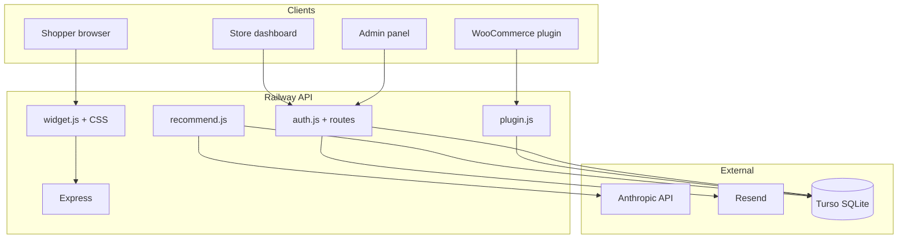
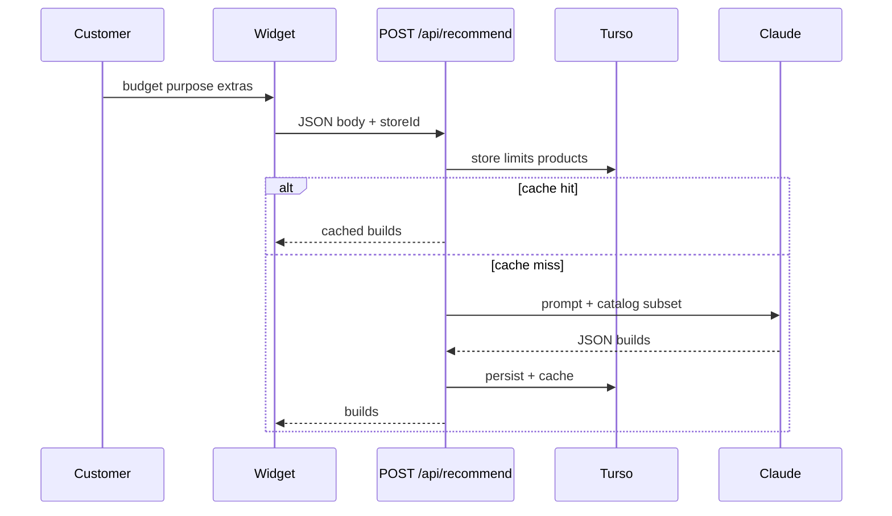

# BuildBot — Complete Project Documentation
> Last Updated: 10 May 2026  
> This file is the canonical project brain; it may appear as `PROGRESS.md` or `progress.md` depending on the OS.

**Paste the whole file into a new Cursor / ChatGPT / Claude thread** when you want a fresh model to pick up full context. For day-to-day work, read **§0 first**, then §1–4, then the section you are implementing.

---

## 0. AI HANDOFF — CONTEXT, ROADMAP, AND HOW TO CONTINUE

### 0.1 What this product is (one paragraph)

BuildBot is B2B SaaS for PC parts retailers. Store owners configure a catalog (manual CSV/CRUD in the dashboard **or** WooCommerce sync via a WordPress plugin). Shoppers use an embedded **widget** (`server/widget.js` served from Railway) to enter budget, purpose, and extras; the backend (`server/routes/recommend.js`) loads allowed products from Turso, optionally uses caching, calls **Anthropic Claude** (Haiku), and returns **three** tiered builds. Limits apply by plan (trial / Starter / Growth / Pro). Payments are manual JazzCash/EasyPaisa with admin approval. Email goes through **Resend**.

### 0.2 Canonical entry points (do not guess paths)

| Area | File(s) |
|------|---------|
| **Landing + login/signup** | `dashboard/index.html` → redirects authenticated users to `dashboard/dashboard.html` |
| **Logged-in store app** | `dashboard/dashboard.html` (sidebar tabs: Overview, Store & sync, Products, Analytics, Install Widget, Widget Settings, Billing, Account, Help) |
| **Admin** | `dashboard/admin.html` |
| **API + widget bundle** | `server/index.js`, `server/widget.js`, `server/routes/*.js` |
| **WooCommerce plugin** | `plugin/buildbot-woocommerce/buildbot-woocommerce.php` (zip copied to `server/` for download) |
| **Sample CSV** | `buildbot-template.csv` |

Local API URL switching lives in `dashboard/config.js`.

### 0.3 Catalog modes (critical UX rule — implemented Step 1)

Stores distinguish **Manual / CSV** vs **WooCommerce** using `localStorage` key `bb_store_mode` (`custom` vs `woo`).

- **Manual / CSV:** Owner manages products in BuildBot; **Install Widget** tab shows the `<script>` embed snippet.
- **WooCommerce:** Widget is injected by the **plugin**; owner uses **Store ID + plugin secret** in WordPress. The **Install Widget** sidebar item and mobile Install tab are **hidden**; `publishWidgetCTA()` sends users to **Store & sync** instead. Direct `showTab('embed')` redirects to Store when mode is Woo.

Implementation anchors in `dashboard/dashboard.html`: `catalogModeIsManual`, `publishWidgetCTA`, `updateInstallWidgetNavVisibility`, guard at top of `showTab`.

### 0.4 System dependency graph



### 0.5 Recommendation path (widget → AI)



### 0.6 Phased roadmap (execute in order; small PR-sized steps)

| Phase | Theme | Examples |
|-------|--------|----------|
| **A — Launch credibility** | Production hygiene | Remove `TEST_MODE` / `RESEND_TEST_EMAIL`, verify Resend domain, Railway hobby vs cold start, optional combined settings endpoint |
| **B — Truth & polish** | Correctness + UX | Apply `widget_bg` in `server/widget.js` (known gap §16), structured AI output + server-side validation of picked SKUs, clearer limit copy in widget |
| **C — Stickiness** | Retention / insight | Weekly owner emails, “most recommended products,” Woo category mapping UI |
| **D — Scale** | Enterprise-ish | Shared rate limit store (Redis), REST Woo alternative, teams/roles, white-label |

### 0.7 Step log (what was agreed “step by step”)

- **Step 1 — DONE (May 2026):** Dashboard IA for Install Widget vs WooCommerce (`dashboard/dashboard.html`) + this `PROGRESS.md` refresh (§0, §4, §12, §15).
- **Step 2 — NEXT (suggested):** Fix **§16 item 7** — wire `widget_bg` from store config into `server/widget.js` init so dashboard preview matches production.

### 0.8 Instructions for the next AI session

1. Read **§0** and **§3–§7** of this file so you know stack, schema, and endpoints.  
2. Confirm the **current step** with the user (default: **Step 2** above unless they redirect).  
3. Implement **one step at a time**; after each step, update **§0.7** and **§15/§16** if behavior or bugs changed.  
4. Prefer editing **`dashboard/dashboard.html`** for store UI and **`server/widget.js`** for the embed bundle (Railway serves from `server/`, not `widget/`).  
5. Do not assume React — the dashboard is **vanilla JS**.

---

## 1. WHAT IS BUILDBOT?

BuildBot is a B2B SaaS product. It is an AI-powered PC build recommender
widget that PC parts stores embed on their websites.

A floating ⚡ chat bubble appears on the store's website. When a customer
clicks it, they enter their budget, purpose, and any extras they want.
BuildBot reads that store's product catalog and uses Claude AI to recommend
a complete, compatible PC build using only products that store actually sells.

### Target Market
PC parts stores in Pakistan — StarTech, local computer shops, WooCommerce stores.

### Business Model
- Store owners sign up on BuildBot dashboard
- 14-day free trial (no card needed)
- Pay monthly via JazzCash or EasyPaisa (manual verification)
- Starter Rs 2,999 | Growth Rs 6,999 | Pro Rs 14,999
- Admin (Neehal) manually approves payments within 24 hours

---

## 2. LIVE URLS

```
Dashboard:   https://buildbot-nine.vercel.app/
Admin Panel: https://buildbot-nine.vercel.app/admin.html
Server API:  https://buildbot-production.up.railway.app/
Widget JS:   https://buildbot-production.up.railway.app/widget.js
Plugin ZIP:  https://buildbot-production.up.railway.app/buildbot-woocommerce.zip
```

---

## 3. COMPLETE TECH STACK

```
Backend:        Node.js + Express.js
Database:       Turso (cloud SQLite — libsql client)
Frontend:       Vanilla HTML + CSS + JavaScript (no framework; Vite devDependency only)
Widget:         Vanilla JS IIFE (immediately invoked function expression)
AI Engine:      Anthropic Claude API (claude-3-5-haiku-20241022)
Authentication: JWT (jsonwebtoken) + bcryptjs
OAuth:          Google Sign-In (google-auth-library + GSI client)
Email:          Resend API (HTTP-based, not SMTP — Railway blocks SMTP)
File Upload:    Multer (memory storage — Railway has no persistent disk)
Hosting Backend: Railway.app (free tier, Node.js)
Hosting Frontend: Vercel (free tier, static files)
Database Host:  Turso.tech (free tier, cloud SQLite)
Payments:       JazzCash + EasyPaisa (manual, no payment gateway)
WordPress Plugin: PHP 7.4+, WooCommerce 5.0+
```

### Why These Choices Were Made
- **Vanilla JS** over React: simpler, no build step, easier to debug
- **SQLite/Turso** over PostgreSQL: existing code was SQLite, Turso = cloud SQLite
- **Resend** over Gmail SMTP: Railway free tier blocks ports 465 and 587
- **Memory storage** for Multer: Railway containers have no persistent disk
- **Manual payments**: No Stripe/PayPal in Pakistan, JazzCash/EasyPaisa standard
- **Railway** over Render: Render required card, Railway had GitHub free tier

---

## 4. COMPLETE FOLDER STRUCTURE

```
buildbot/                          ← Root (on Desktop)
├── .gitignore                     ← Ignores node_modules, .env, *.db
├── PROGRESS.md                    ← This file
├── buildbot-template.csv          ← Sample CSV for store owners
│
├── widget/
│   └── index.html                 ← Local widget smoke-test page (opens served widget.js)
│
├── dashboard/                     ← Deployed on Vercel
│   ├── index.html                 ← Landing + Login / Signup (routes to dashboard.html when logged in)
│   ├── dashboard.html             ← Logged-in store owner app (all sidebar tabs)
│   ├── admin.html                 ← Admin panel (Neehal only)
│   ├── verify.html                ← Email verification landing page
│   ├── reset-password.html        ← Password reset page
│   ├── config.js                  ← Switches API URL localhost vs production
│   └── vercel.json                ← Vercel routing rules
│
├── plugin/
│   └── buildbot-woocommerce/
│       └── buildbot-woocommerce.php  ← WordPress plugin (zip this folder)
│
└── server/                        ← Deployed on Railway
    ├── index.js                   ← Express entry + cron jobs
    ├── database.js                ← All Turso DB functions
    ├── email.js                   ← Resend email templates + sender
    ├── widget.js                  ← Widget JS served by Railway
    ├── buildbot-woocommerce.zip   ← Plugin zip served for download
    ├── package.json
    ├── .env                       ← NOT on GitHub
    └── routes/
        ├── auth.js                ← Signup/Login/Reset/Settings/store-config
        ├── upload.js              ← CSV upload + product CRUD
        ├── recommend.js           ← AI recommendations + limit enforcement
        ├── analytics.js           ← Store usage stats
        ├── payment.js             ← Payment submission + history
        ├── admin.js               ← Admin-only routes
        └── plugin.js              ← WooCommerce plugin API endpoints
```

---

## 5. ENVIRONMENT VARIABLES

### Railway (server — set manually, NOT on GitHub):
```
ANTHROPIC_API_KEY   = sk-ant-...
JWT_SECRET          = buildbot-super-secret-jwt-key-2024
PORT                = 3001
ADMIN_EMAIL         = workwithneehal@gmail.com
ADMIN_PASSWORD      = admin123
GOOGLE_CLIENT_ID    = ...apps.googleusercontent.com
TURSO_URL           = libsql://buildbot-neehal-shahid.aws-ap-south-1.turso.io
TURSO_TOKEN         = eyJ...
RESEND_API_KEY      = re_...
RESEND_TEST_EMAIL   = muhammadneehal1805@gmail.com
APP_URL             = https://buildbot-nine.vercel.app
TEST_MODE           = true   ← REMOVE when going live with real customers
```

### Important Notes:
- `RESEND_TEST_EMAIL` redirects ALL emails to your Gmail for testing
- Remove it when you verify a domain at resend.com/domains
- `TEST_MODE=true` returns fake AI builds to save API credits during testing
- Remove `TEST_MODE` before real customers use it

---

## 6. COMPLETE DATABASE SCHEMA (Turso)

```sql
-- Store owners (your customers)
stores (
  id, store_id TEXT UNIQUE, name, email UNIQUE, password (bcrypt hashed),
  plan DEFAULT 'trial', plan_status DEFAULT 'active',
  trial_ends DEFAULT date +14 days,
  brand_color DEFAULT '#7c6af7',
  currency DEFAULT 'PKR',
  widget_title DEFAULT 'BuildBot',
  welcome_msg, button_text DEFAULT 'Get Started',
  widget_bg DEFAULT '#1a1d27',
  widget_enabled DEFAULT 1,
  plugin_secret,        ← WooCommerce plugin auth key
  woo_connected DEFAULT 0,
  woo_url, woo_last_sync, woo_product_count,
  email_verified DEFAULT 0,
  created_at
)

-- Products for each store
products (
  id, store_id FK→stores, name, category, price REAL,
  description, in_stock DEFAULT 1, created_at
  FOREIGN KEY store_id ON DELETE CASCADE
)

-- Every recommendation ever made
recommendations (
  id, store_id FK→stores, budget REAL, purpose,
  extras, result TEXT (JSON), created_at
  FOREIGN KEY store_id ON DELETE CASCADE
)

-- Payment records
payments (
  id, store_id FK→stores, amount REAL, method,
  transaction_ref, plan, status DEFAULT 'pending', created_at
  FOREIGN KEY store_id ON DELETE CASCADE
)

-- Email/password reset tokens
tokens (
  id, email, token, type (verify|reset),
  expires_at, used DEFAULT 0, created_at
)

-- Prevents duplicate trial ending emails
trial_emails_sent (
  store_id, days_left, PRIMARY KEY (store_id, days_left)
)
```

---

## 7. ALL API ENDPOINTS

```
PUBLIC (no auth):
POST /api/signup              → Creates store, sends welcome + verify email
POST /api/login               → Returns JWT token (7 day expiry)
POST /api/google-auth         → Google sign-in / sign-up (auto-verifies email)
GET  /api/verify-email?token= → Marks email verified
POST /api/forgot-password     → Sends password reset email
POST /api/reset-password      → Updates password with reset token
GET  /api/store-config/:id    → Returns branding, widget settings, widgetEnabled
GET  /api/products/:storeId   → Returns in-stock products (for widget + AI)
POST /api/recommend           → AI build recommendation with limit check
GET  /api/plans               → Returns plan pricing info
GET  /widget.js               → Serves the embeddable widget file
GET  /widget.css              → Serves widget CSS (loaded by widget.js)
GET  /buildbot-woocommerce.zip → Downloads WordPress plugin
GET  /plugin-update.json      → Plugin auto-update feed

STORE OWNER (JWT required in Authorization: Bearer <token>):
GET  /api/me                  → Fresh store data from DB
PUT  /api/settings            → Saves brand color + currency
PUT  /api/widget-settings     → Saves widget title/msg/button/bg
PUT  /api/change-password     → Change password from dashboard
POST /api/upload              → Bulk CSV upload (memory storage)
GET  /api/products/manage/:id → All products including out of stock
POST /api/product             → Add single product
PUT  /api/product/:id         → Edit single product
PUT  /api/product/:id/stock   → Toggle in/out of stock
DELETE /api/product/:id       → Delete single product
GET  /api/analytics           → Store usage statistics
POST /api/payment/submit      → Submit JazzCash/EasyPaisa payment proof
GET  /api/payment/history     → Store's payment history

PLUGIN (X-BuildBot-Store-ID + X-BuildBot-Secret headers):
POST /api/plugin/ping         → Test connection from WordPress
POST /api/plugin/sync         → Full product sync from WooCommerce
POST /api/plugin/product/update → Single product update
POST /api/plugin/product/delete → Single product delete
POST /api/plugin/widget-toggle → Enable/disable widget from WordPress
GET  /api/plugin/widget-config/:id → Widget enabled status for plugin

ADMIN (admin JWT — POST /api/admin/login first):
GET  /api/admin/overview      → All stores + pending payments + revenue
GET  /api/admin/stores        → All stores with product/rec counts
GET  /api/admin/payments      → All payments with store info
POST /api/admin/approve-payment → Approves payment + sends email
POST /api/admin/reject-payment  → Rejects payment + sends email
POST /api/admin/disable-store   → Disables store widget
POST /api/admin/activate-store  → Re-enables store
POST /api/admin/delete-store    → Deletes store + all related data
POST /api/admin/forgot-password → Sends admin reset link email
POST /api/admin/reset-password  → Resets admin password with token
GET  /api/admin/me              → Admin profile
PUT  /api/admin/profile         → Update admin name/email
PUT  /api/admin/password        → Change admin password
GET  /api/admin/db-audit        → DB integrity report (orphans/tokens/counts)
```

---

## 8. RECOMMENDATION LIMITS

```
Trial:   3 per DAY  (resets at midnight)
Starter: 500 per MONTH
Growth:  2,000 per MONTH
Pro:     Unlimited (999999)

When limit hit: widget shows friendly message
"Sorry, we couldn't generate a recommendation right now.
Please try again later or contact the store directly."
Store owner sees warning on dashboard home tab.

TEST_MODE=true on Railway: returns fake build data, zero API credits used
```

---

## 9. EMAIL SYSTEM

### Provider: Resend (resend.com)
- Free plan: 3,000 emails/month
- Uses HTTP API, not SMTP (Railway blocks SMTP ports 465/587)
- Until domain verified: all emails go to RESEND_TEST_EMAIL

### Email Templates (in server/email.js):
```
welcomeEmail(name, email)                    → On signup
emailVerificationEmail(name, email, token)   → On signup
paymentApprovedEmail(name, email, plan)      → When admin approves
paymentRejectedEmail(name, email, plan)      → When admin rejects
trialEndingEmail(name, email, daysLeft)      → Auto 3 days + 1 day before trial ends
passwordResetEmail(name, email, token)       → On forgot password
```

### Trial Email Deduplication:
Tracked in `trial_emails_sent` table (store_id + days_left as primary key).
Prevents sending same email twice if cron runs multiple times.

### To Go Live With Real Emails:
1. Go to resend.com/domains
2. Add workwithneehal.com
3. Add DNS records in Hostinger
4. Remove RESEND_TEST_EMAIL from Railway variables

---

## 10. PASSWORD RULES

```
Minimum 8 characters
Must contain: uppercase + lowercase + number + special character
Example shown to users: MyStore@123
Password strength bar shown on signup and reset pages
```

---

## 11. WIDGET FEATURES

```
Design: Glassmorphism with backdrop blur
Colors: Custom brand color + custom background color
Auto-contrast: Button text automatically black or white based on brand color
Customization: Title, welcome message, button text (set by store owner)
Widget disabled: Checks widget_enabled from server — hides itself if false

Extras:
- Serves `widget.css` from backend and loads it dynamically
- PDF download of recommendation (html2pdf client-side)

Flow (Welcome + 3 inputs + results):
S1: Welcome screen with custom message
S2: Budget input + quick-select chips (50k/80k/1.2L/2L)
S3: Purpose selection (8 options: Gaming, Office, Coding, etc.)
S4: Extras selection (Monitor, Keyboard, Mouse, etc.) + free text
S5: Loading animation
S6: Results
→ AI generates **3 build options** (Budget / Balanced / Max)
→ Cards view + detail modal per build (parts, reasons, totals)
→ Missing categories shown when store lacks parts
→ Friendly customer-safe error if limit hit / store inactive / AI down

Widget is served by Railway at /widget.js
Must live in server/widget.js (not widget/widget.js)
```

---

## 12. DASHBOARD FEATURES

```
Landing Page (index.html): Hero, features grid, pricing table (3 plans)
Signup: Strong password enforcement + strength bar + email verification
Login: JWT stored in localStorage + server validation on every page load
Forgot Password: Email reset link with 1-hour expiry

Logged-in app (dashboard.html) — sidebar tabs:

OVERVIEW (home):
- Stats: recommendations, products, avg budget, today count
- Trial limit warning with upgrade link (3/day on trial)
- Getting-started journey (catalog mode aware)
- Recent activity table

STORE & SYNC:
- Permanent catalog source: Manual / CSV vs WooCommerce (bb_store_mode)
- WooCommerce: plugin download, secret key, connection/s sync context

PRODUCTS TAB:
- Search by name/description
- Filter by category and stock status
- Stats: total, in-stock, out-of-stock, categories count
- Bulk CSV upload (memory storage, replaces all products)
- Add single product (modal popup)
- Edit product (modal popup, pre-filled)
- Delete product (confirmation modal)
- Toggle in/out of stock (inline, no page reload)
- When WooCommerce connected: shows read-only message

ANALYTICS TAB:
- Total builds, avg budget, today, this week
- Popular purposes bar chart
- Daily activity last 7 days bar chart

INSTALL WIDGET TAB:
- Only visible when catalog mode is Manual / CSV (not WooCommerce)
- Script snippet + copy; layout preview; “Mark as Live” helpers
- WooCommerce stores use the WordPress plugin instead (Store & sync)

BILLING TAB:
- Current plan display with status badge
- Plan selector (Starter/Growth/Pro)
- JazzCash/EasyPaisa payment instructions with amounts
- Transaction ID submission form
- Payment history table with status badges

WIDGET SETTINGS + BILLING + ACCOUNT + HELP:
- Widget Settings: brand/bg colors, currency, title, welcome message, button text, preview
- Billing: plans, manual payment submission, history
- Account: profile/security
- Help & Docs: quick links (Install → publishWidgetCTA routes correctly per catalog mode)
```

---

## 13. WOOCOMMERCE PLUGIN

### File: plugin/buildbot-woocommerce/buildbot-woocommerce.php
### Download: https://buildbot-production.up.railway.app/buildbot-woocommerce.zip

### What It Does:
```
1. Checks WooCommerce is installed on activation (deactivates if not)
2. Store owner enters Store ID + Secret Key
3. Tests connection via /api/plugin/ping
4. Syncs all WooCommerce products to BuildBot
5. Auto-injects widget script on frontend (when widget enabled)
6. Real-time hooks: product add/update/delete → instantly updates BuildBot
7. Auto-sync cron every 6 hours
8. Auto-update: checks /plugin-update.json on Railway
9. Widget enable/disable toggle in WordPress admin
10. Category breakdown showing how products were mapped
11. Non-PC store warning if no PC categories detected
```

### Plugin Authentication:
Not JWT. Uses custom headers:
```
X-BuildBot-Store-ID: store-id-here
X-BuildBot-Secret: bb_live_xxxxxxxxxxxxxxxxxxxxxxxxxxxxxxxx
```
Secret key generated from BuildBot dashboard → Settings → WooCommerce section.

### Smart Category Mapping:
Products mapped to BuildBot categories using two methods:
1. WooCommerce category name keyword matching
2. Product name keyword matching (fallback)

Categories supported:
CPU, Motherboard, RAM, Storage, GPU, PSU, Case, Monitor,
Cooling, Networking, UPS, Peripherals, Cable, Software, Accessory

### Known Bug History:
- buildbotNonce was undefined (fixed by moving nonce into inline script)
- Functions were not globally accessible (fixed by using window.functionName)
- Auto-inject used wrong URL format (fixed)

---

## 14. ADMIN PANEL

```
URL: https://buildbot-nine.vercel.app/admin.html
Login: ADMIN_EMAIL + ADMIN_PASSWORD from Railway env vars

Features:
- Overview: total stores, recommendations, revenue, pending payments
- Pending payments alert (blinking dot) with approve/reject buttons
- All stores table with search, edit, disable, delete
- All payments history
- Platform analytics: trial vs paid, top stores by recommendations
- Approve payment → store plan activates + email sent to store owner
- Reject payment → email sent to store owner
- Delete store → removes all related data (products, payments, recommendations)
```

---

## 15. WHAT IS COMPLETE ✅

### Infrastructure:
- [x] Backend on Railway (auto-deploys from GitHub)
- [x] Frontend on Vercel (auto-deploys from GitHub)
- [x] Database on Turso (survives Railway redeploys)
- [x] Emails via Resend (working, going to test email)
- [x] GitHub private repository

### Core Features:
- [x] Store owner signup + login with JWT
- [x] Strong password enforcement + strength bar
- [x] Email verification (enforced on login)
- [x] Google sign-in / sign-up (auto-verifies email)
- [x] Forgot password + reset flow
- [x] Turso cloud database (all migrations in initDB)
- [x] CSV bulk upload (memory storage, Railway compatible)
- [x] AI recommendations (Claude `claude-3-5-haiku-20241022`)
- [x] Three-tier recommendations (3 builds returned)
- [x] Recommendation limits (3/day trial, 500/mo starter, 2000/mo growth)
- [x] TEST_MODE for free testing
- [x] Product management (add/edit/delete/stock toggle)
- [x] Product search + category + stock filters
- [x] Widget customization (color, bg, title, message, button)
- [x] Glassmorphism widget with auto-contrast
- [x] WooCommerce plugin (sync, real-time hooks, auto-update)
- [x] Plugin widget enable/disable toggle
- [x] Smart category mapping (50+ keywords + name detection)
- [x] JazzCash/EasyPaisa payment submission
- [x] Admin panel (full management)
- [x] Admin approve/reject payments with emails
- [x] Trial ending emails (auto, deduplicated)
- [x] Store owner delete with cascade cleanup
- [x] Duplicate store ID prevention (random suffix)
- [x] AI API cost optimization (Haiku model, budget filtering, token reduction)
- [x] Event-based infinite caching (invalidates instantly on product updates)
- [x] IP-based rate limiting on widget (prevents abuse/scraping)
- [x] Graceful AI Fallback UI in widget (handles Anthropic API downtime gracefully)
- [x] Premium SaaS UI/UX Redesign for WooCommerce Plugin Admin Dashboard
- [x] Fixed duplicate product database bug (Syncing now matches strictly by `woo_id`)
- [x] Install Widget navigation hidden for WooCommerce catalog mode; CTAs use Store & sync (`dashboard/dashboard.html`)

---

## 16. KNOWN ISSUES / BUGS TO FIX 🔧

```

2. RESEND_TEST_EMAIL still set → all emails go to Neehal's Gmail
   → Remove when verifying domain at resend.com/domains

3. TEST_MODE=true still on Railway → fake AI responses
   → Remove when going live with real customers

4. Railway free tier sleeps after 30 min inactivity
   → First widget load after sleep takes 10-15 seconds
   → Fix: Upgrade to Railway $5/mo hobby plan at first paying customer

5. Settings save button calls both /api/settings AND /api/widget-settings
   → Could cause race condition if one fails
   → Should be one combined endpoint (minor, low priority)

6. admin.html has no rate limiting on login
   → Could be brute forced
   → Low priority for now

7. Widget background color from dashboard (`widget_bg`) is stored in DB but not applied in `server/widget.js`
   → `WIDGET_BG` is currently hardcoded, but CSS variables include `--bb-bg`
   → Fix: set `WIDGET_BG = data.widgetBg || WIDGET_BG` in widget init

8. In-memory IP rate limiting resets on deploy/restart and doesn't share state across instances
   → OK for MVP; for scale, move to a shared store (Redis) or Cloudflare/WAF rules
```

---

## 17. NEXT FEATURES TO BUILD

```
Priority 1 (Critical):
- [ ] Remove TEST_MODE and RESEND_TEST_EMAIL for real launch
- [ ] Verify Resend domain for real emails

Priority 2 (Important):
- [ ] WooCommerce REST API option (alternative to plugin)
- [ ] Recommendation limit enforcement display in widget
- [ ] Weekly analytics email to store owners
- [ ] Product: which products get recommended most

Priority 3 (Growth):
- [ ] Urdu language support in widget
- [ ] WhatsApp notification to admin on new payment/signup
- [ ] Multiple widget styles (sidebar, inline)
- [ ] Customer can save/share their build
- [ ] White-label option (remove Powered by BuildBot)
- [ ] Referral system (1 free month for referring)
- [ ] WooCommerce category mapping UI (let store owner fix wrong mappings)
```

---

## 18. HOW TO RUN LOCALLY

```bash
# Terminal 1 — Backend
cd Desktop/buildbot/server
npm install
node index.js
# Should print: Turso database connected and tables ready!
# Runs at: http://localhost:3001

# Terminal 2 — Frontend  
cd Desktop/buildbot/dashboard
npm install
npx serve .
# Runs at: http://localhost:3000

# URLs:
# Landing/login: http://localhost:3000/index.html
# Store app:     http://localhost:3000/dashboard.html
# Admin:        http://localhost:3000/admin.html
# Widget smoke test: open widget/index.html in browser (file:// or serve repo root)
# Verify:       http://localhost:3000/verify.html
# Reset:        http://localhost:3000/reset-password.html
```

---

## 19. DEPLOYMENT PROCESS

### Backend (Railway):
1. Push to GitHub → Railway auto-deploys in ~2 minutes
2. Check deployment logs in Railway dashboard
3. Visit https://buildbot-production.up.railway.app/ → should show version 2.0

### Frontend (Vercel):
1. Push to GitHub → Vercel auto-deploys in ~1 minute
2. Visit https://buildbot-nine.vercel.app/ → should show landing page

### Plugin Update Process:
1. Edit plugin/buildbot-woocommerce/buildbot-woocommerce.php
2. Increment version number in plugin header AND BUILDBOT_VERSION constant
3. Zip the buildbot-woocommerce folder → buildbot-woocommerce.zip
4. Copy zip to server/ folder
5. Update version in /plugin-update.json route in server/index.js
6. Push to GitHub → WordPress stores auto-detect update

---

## 20. IMPORTANT RULES LEARNED FROM EXPERIENCE

```
1. widget.js must be in server/widget.js — Railway serves from there
   (widget/widget.js is just a source copy, not served)

2. .env is NOT on GitHub — add variables manually on Railway dashboard

3. Modals in dashboard/index.html must be:
   - OUTSIDE .main div
   - INSIDE #page-app div
   - With style="display:none" inline AND .modal-bg CSS class

4. multer must use memory storage on Railway (no persistent disk)

5. Railway free tier blocks SMTP ports — use Resend HTTP API for email

6. Turso doesn't support PRAGMA foreign_keys via HTTP — handle cascade manually

7. WooCommerce plugin: use var not const/let for global JS functions
   Use window.functionName = async function() {} pattern

8. If something breaks: git log --oneline → find good commit hash
   → git checkout HASH -- . → git add . → git commit → git push

9. Always test locally before pushing to GitHub

10. Database migrations: run ALTER TABLE in try/catch (column may already exist)
```

---

## 21. BUSINESS CONTEXT

```
Founder:        Neehal (non-developer, building with Claude AI)
Target Market:  Pakistan PC parts stores
Payment Method: JazzCash + EasyPaisa (manual verification)
Hosting Budget: $0 (all free tiers)
Domain:         buildbot.workwithneehal.com (not connected yet, using vercel URL)
GitHub:         Private repository named "buildbot"
Admin Email:    workwithneehal@gmail.com
```

---

## 22. BUILD BOT WIDGET FIXES - COMPLETED MAY 2026

### Files Modified During Widget Fixes

#### 1. widget.js (server/widget.js)

**Before Changes:**
- Dark glassmorphism theme with Montserrat/Poppins fonts
- Alert-based form validation using `alert()` calls
- Global `window._bbStepTimer` timer causing memory leak
- Basic PDF generation with minimal styling and structure
- All interactive elements were `<div>` tags (no accessibility)
- Fixed budget chips: 50k, 80k, 120k, 200k (hardcoded)
- No retry functionality for error states
- Basic error handling without user-friendly recovery
- No compatibility checking in backend AI prompt
- No budget presets support from store configuration
- Race condition in html2pdf loading

**After Changes:**
- Clean minimal light theme with Inter font integration
- Inline field validation with `showError()`/`hideError()` helper functions
- Timer moved inside IIFE closure as `bbTimer` with proper cleanup
- Complete PDF rewrite with professional HTML layout and inline styles
- All chips converted to `<button>` elements with `aria-pressed` attributes
- Dynamic budget chips from store config via `window._bbBudgetPresets`
- Retry button added to error states with `retryBuild()` function
- Enhanced error handling with proper state management and recovery
- Comprehensive compatibility checking in AI prompt with detailed requirements
- Budget presets support via store configuration system
- html2pdf race condition fix with polling mechanism
- Store build data (`_lastBuilds`, `_lastCurrency`) for PDF access
- Per-build PDF download in modal with individual build support
- Configurable CSS URL via `data-css-url` attribute for local development
- Proper step progression with 4 loading steps and done states
- Accessibility improvements with ARIA attributes and semantic HTML

#### 2. widget.css (server/widget.css)

**Before Changes:**
- Dark glassmorphism theme with blur effects and gradients
- Complex visual effects with backdrop filters
- Poppins/Montserrat font family
- Dark color scheme with low contrast ratios
- Heavy visual styling with shadows and glows
- Non-minimal design with decorative elements

**After Changes:**
- Clean minimal light theme with solid backgrounds
- Simplified design with subtle borders and shadows
- Inter font family for better readability
- Light color scheme with proper contrast ratios
- CSS variables for consistent theming (`--bb-bg`, `--bb-text`, etc.)
- Removed unnecessary visual effects and complexity
- Modern, accessible design patterns
- Responsive and maintainable structure

#### 3. recommend.js (server/routes/recommend.js)

**Before Changes:**
- Basic compatibility checking with simple rules
- Simple part selection logic without detailed validation
- Minimal compatibility requirements in AI prompt
- No structured compatibility data in response format

**After Changes:**
- Comprehensive compatibility checking in AI prompt with detailed requirements:
  - CPU socket matching motherboard
  - RAM type and speed compatibility
  - PSU wattage with 20% headroom
  - GPU power connector matching
  - CPU cooler TDP requirements
  - M.2 SSD interface compatibility
  - Case form factor support
- Compatibility badges and notes in JSON response format
- Enhanced test mode with compatibility fields
- Structured compatibility data for frontend display

### Key Improvements Summary

**✅ Theme & Accessibility:**
- Complete UI redesign from dark to light theme
- Font change to Inter for better readability
- Improved contrast ratios for accessibility compliance
- Added proper ARIA attributes to all interactive elements
- Converted divs to semantic button elements

**✅ User Experience:**
- Replaced intrusive alerts with inline error messages
- Real-time validation with show/hide logic
- Added retry functionality for error recovery
- Dynamic budget presets from store configuration
- Better loading animation with proper step progression

**✅ Technical Improvements:**
- Fixed global memory leak with timer encapsulation
- Added html2pdf race condition handling
- Made CSS URL configurable for local development
- Enhanced error handling with graceful degradation
- Improved event handling and state management

**✅ PDF Generation:**
- Complete rewrite with professional HTML layout
- Inline styles for consistent PDF appearance
- Per-build PDF downloads in modal
- Store build data for PDF access
- Compatibility information included in PDFs

**✅ Backend Enhancements:**
- Enhanced AI prompt with detailed compatibility checking
- Added compatibility data to response format
- Updated test mode with new fields
- Better structured AI responses

### Implementation Notes

- **Backward Compatible:** All changes maintain existing API compatibility
- **Graceful Degradation:** Fallbacks for missing configurations
- **Performance:** Optimized event handling and memory management
- **Testing:** Comprehensive coverage of all identified issues

### Files Modified Summary

| File | Lines Changed | Primary Focus |
|------|---------------|----------------|
| `widget.js` | ~200 lines | Validation, PDF, Accessibility, Timer Fix |
| `widget.css` | ~900 lines | Complete theme rewrite to light design |
| `recommend.js` | ~50 lines | Enhanced AI compatibility checking |

**Status: ✅ All 10 Widget Fixes Complete**

The BuildBot Widget now features:
- Modern, accessible light theme with proper contrast
- Robust form validation without intrusive alerts
- Professional PDF generation with compatibility info
- Enhanced accessibility with ARIA attributes
- Better error handling and recovery options
- Configurable budget presets and CSS URLs
- Fixed memory leaks and race conditions
- Comprehensive compatibility checking

### Current Prompt (May 2026)
The user provided a specific set of 10 fixes to implement in order:

1. **Modal PDF button downloads null (IIFE scope bug)** - Fixed by moving `_currentBuild` to IIFE top level
2. **"Try Again" button does nothing** - Fixed by removing standalone function and adding callback parameter
3. **Loading steps not reset on Start Over** - Fixed by adding step reset in restart handler
4. **Modal PDF and close buttons not prominent enough** - Fixed by updating CSS with separate prominent styles
5. **Results screen too large, reduce density slightly** - Fixed by reducing font sizes and spacing
6. **window._bbBudgetPresets global scope leak** - Fixed by using `_budgetPresets` at IIFE level
7. **initWidget async/await mixed with .then() chains** - Fixed by rewriting as clean async/await
8. **Modal overlay click handler reattached on every open** - Fixed by moving to bindEvents once
9. **recommend.js: limit extras input length** - Fixed by adding `safeExtras` variable with 200 char limit
10. **requireCompatibility field removed from request** - Fixed by removing unused field

All fixes were implemented exactly as specified, maintaining backward compatibility and following the constraint of not changing IIFE structure or AI prompt text.

## 23. HOW TO START A NEW CLAUDE CHAT

Paste **this entire file** and say:

> I am building BuildBot. Here is my PROGRESS.md. Read **§0** first. We work **step by step**. Last completed step is in **§0.7**. Today implement: **[YOUR STEP]** — then update §0.7 and §15/§16 if anything changed.

The model should treat §0 as the authoritative continuation guide.
